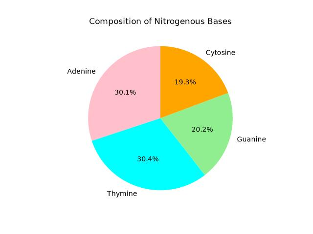

# BioSeqScope: Human Beta-Globin (HBB) Gene Analysis

## Project Overview

BioSeqScope is a beginner-friendly bioinformatics project that analyzes the Human Beta-Globin (HBB) gene sequence obtained from a FASTA file.

Using Python, Biopython, and Matplotlib, the project reads the DNA sequence, calculates nucleotide composition, determines AT and GC content, and visualizes the results using a pie chart.

## Objectives

- Read a FASTA sequence using Biopython
- Display sequence information
- Calculate sequence length
- Count nucleotide frequencies
- Calculate GC content
- Calculate AT content
- Visualize nucleotide composition using a pie chart

## Dataset

Source: NCBI

Gene analyzed:

- Human Beta-Globin (HBB)

## Tools and Libraries

- Python
- Biopython
- Matplotlib

## Project Workflow

1. Import the FASTA sequence
2. Read sequence information as obtained from NCBI database
3. Calculate sequence length
4. Count nucleotide frequencies
5. Calculate AT content
6. Calculate GC content
7. Generate a pie chart for nucleotide composition

## Results

The project provides:

- DNA sequence information
- Sequence length
- Nucleotide frequency (A, T, G, C)
- AT percentage
- GC percentage
- Pie chart visualization of nucleotide composition

### Nucleotide Composition Pie Chart

## Project Structure
BioSeqScope/
│
├── README.md
├── requirements.txt
├── hbbseq.py
├── hbbseqpi.py
├── hbbseq.fasta
└── piechart.jpg
